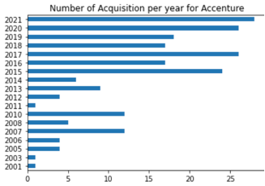
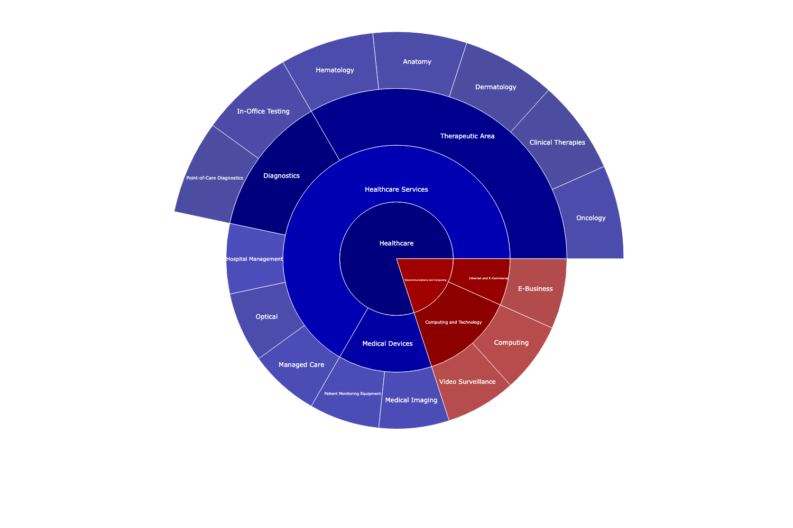

# Hello World ! I'm Réda Hamdouch 👋.

- I am an engineer with a major in computer science and I am currently pursuing the Msc Big Data & Business Analytics at ESCP Business School, Paris & Berlin
- **Project I am currently working on:** With my team, we are participating in the SCOR Datathon which theme is ESG rating for listed companies. It is a Data Science competition between the top schools in France (Polytechnique, CentraleSupéléc, Télécom Paris, HEC, ESSEC, ESCP).
- I am looking for an internship / full time position that would start in July 2023. To contact me : 

    - 📞 +33 6 13 69 83 93
    - 📧  reda.hamdouch@edu.escp.eu
    - 👥 [my Linkedin Profile](www.linkedin.com/in/redahamdouch/)

Throughout my studies, I have done a number of projects all related to the world of Big Data, whether as part of a group project, or subjects that I wanted to explore out of curiosity
In this portfolio, I put at your disposal the following projects:   

## Available Projects
### [Rubik's cube solver](https://github.com/redahamdouch/Rubiks_solver)

- Resolution of a Rubik's cube with a video capture of the cube configuration and resolution with a virtual 3D replication.

*Snapchots of the Rubik's cube solver. Left: Acqusition phase, Right: 3D Modelisation phase*

- *Gif showing some steps towards the resolution of the Rubiks cube produced by our modelling*

### [Image Search Engine](https://github.com/redahamdouch/image_search_engine)
- In this project, the objective is to experiment with several methods to characterise an image (VLAD, histogram, bag of visual words) in order to perform image search engines. The tests conducted allow us to characterise each method in terms of accuracy and execution time.

-***Left**: evolution of recall/precision curves as a function of the size of the vocabulary used, **Middle**: how visual descriptors works, **Right**: evolution of query processing time as a function of vocabulary size.* 

### [Analytics with Pandas](https://github.com/redahamdouch/Analytics_pandas)
- This project aims to manipulate a dataset for analytical purposes. The objective is to answer some analytical questions which requires a work of preprocessing, cleaning, manipulation, conversion, visualization of data using Python's Pandas

*example of the code needed for the question: How many acquisitions did the company with the most acquisitions make per year?*

## Other projects : 

### NLP Classfier : Determining to which category an innovation project belongs.

- The objective of this project is to create a tool able to extract the market research categories of an innovation project from its textual description. I carried out this project with the help of transformers (BERT). The final objective is to create a Data Visualisation tool to compute the results of this classification in a dynamic and intuitive way. I therefore opted for a **sunburst diagram**, an example of which is shown below 

- ***Note** : this digram is the output produced by the classifier with as an input a project  which proposes a technology for skin cancer diagnosis using visual sensors and deep-learning models.*

A Sunburst diagram is useful for visualising hierarchical data, represented by concentric circles. Here are the different pieces of information it groups together:
- The centre circle represents the root nodes, which in our case represents the meta-categories(Healthcare + Telecomunication and Computing).
- The hierarchical relationships between the categories are also represented, going from the centre to the outside of the circle.
- A colour code is present to distinguish the different meta-categories and the underlying categories (e.g. Telecommunications and Computing and its sub-categories in red, Healthcare and its sub-categories in blue)
- The relevance of the categories is represented by the shade of the colour: the more relevant the category is, the darker the colour (e.g. Therapeutic Area relevant, Computing and Technology a little less)

### Computer Vision model: Home Furniture detection in images

- Trained on about 3000 annotated images, I created an object detection model, able to detect the presence of 26 different pieces of furniture on an image. An example of detection performed by the model is available below: 

- This project required a benchmark of several object detection models, in order to get the most out of the state of the art. Since the models needed a lot of computational power, I trained these models on the cloud (AWS).

